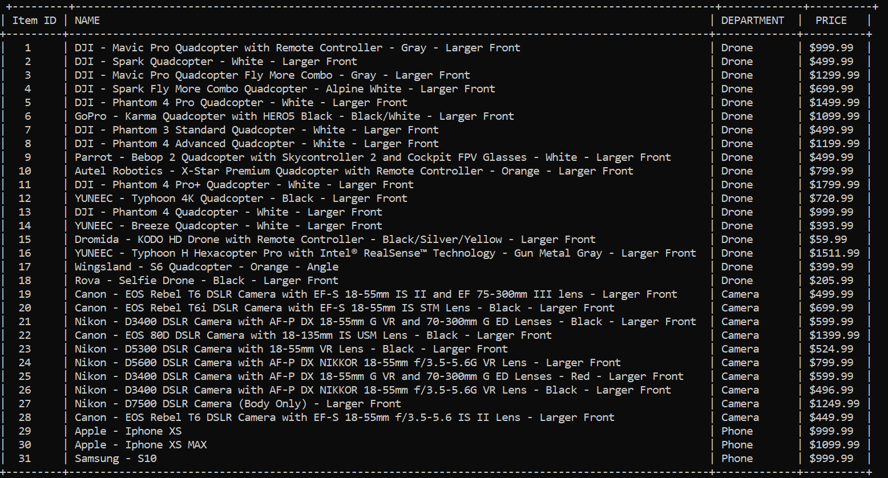
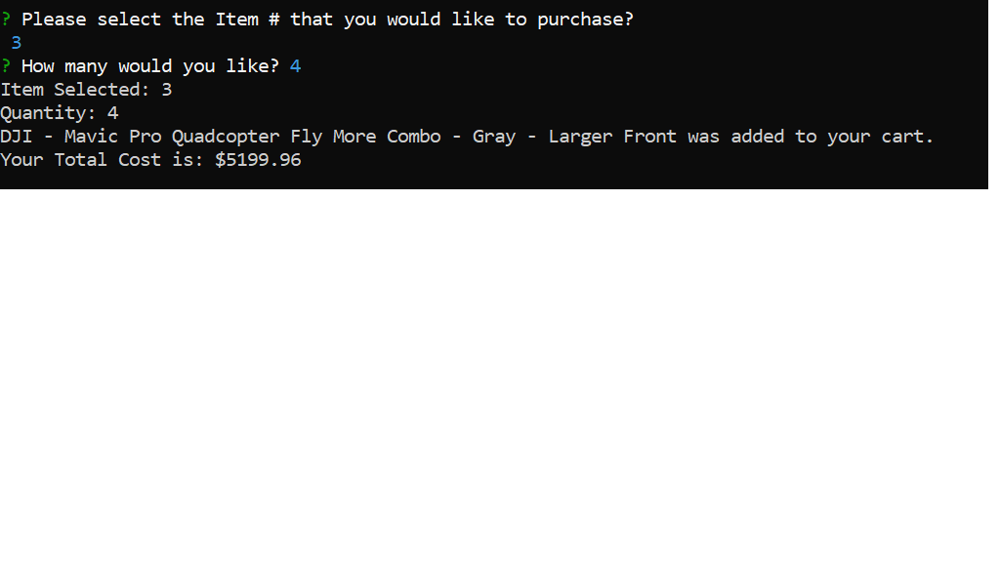
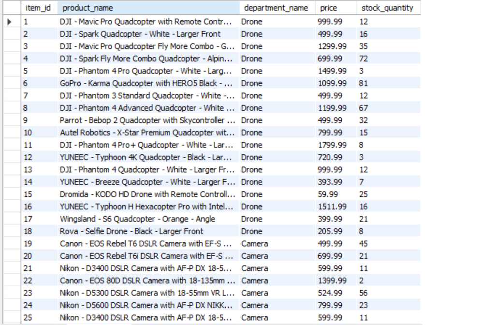
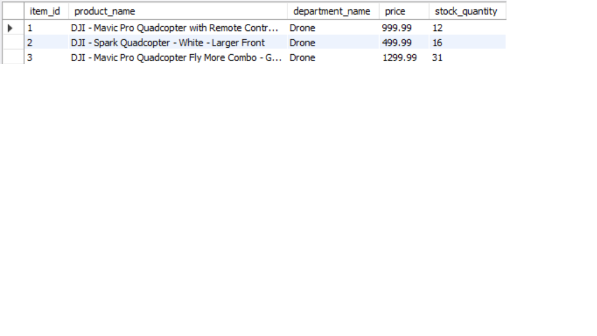

# Store-Front
A CLI interface for an Amazon type store front. 

#Technologies Used
<ul>
    <li>JavaScript</li>
    <li>Node.js</li>
    <li>Inquirer.js</li>
    <li>mySQL</li>
</ul>

#Installation
Use the Node package manager npm to install required dependencies in the package.json file.
```bash
npm install
```

#
Store-Front allows the user to choose an item from the inventory available:


The user will choose an item by typing in the Item ID. Next, the user will enter a quantity. The app will display what item was chosen and calculate the user's cost. 


#
If the order was successful, mySQL will update the items quantity in the database. 

### Database Before Transaction


### Databse Updated After Transaction


#
Otherwise, there is a notice if there insufficient quanitity.
